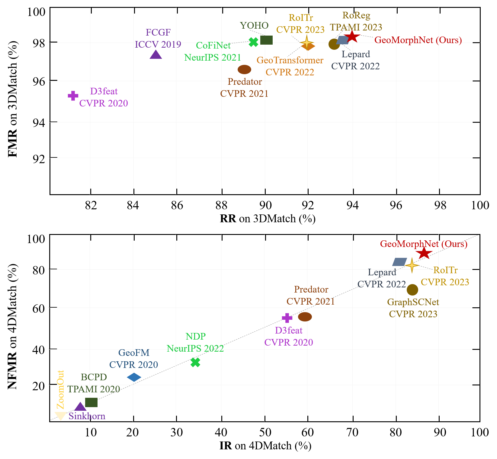
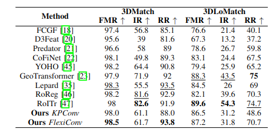
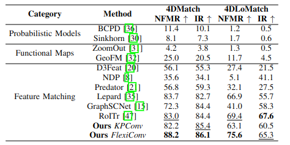
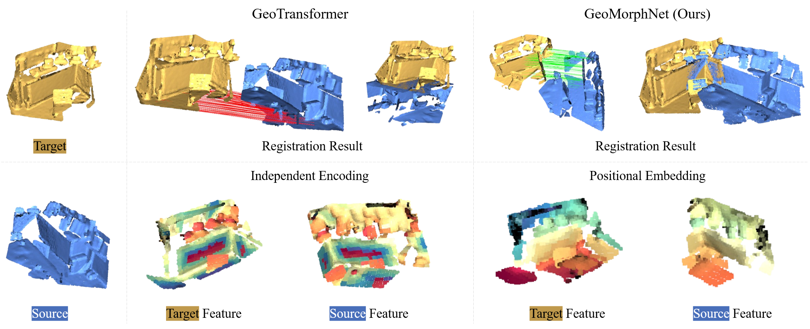
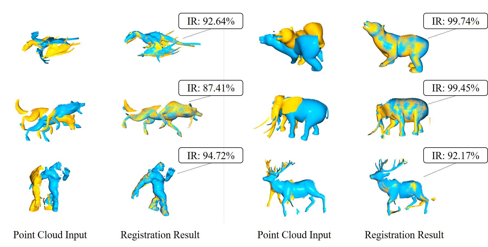

 ## GeoDeformNet: Robust 3D Point Cloud Registration with Geometric Deformation Network

---


Comparison of various methods in terms of feature matching recall (FMR) and registration recall (RR) on the 3DMatch dataset, as well as nonrigid feature matching recall (NFMR) and inlier ratio (IR) on the 4DMatch dataset. Our method achieves state-of-the-art (SOTA) performance on these metrics.




### Method overview

To enhance the robustness and accuracy of 3D point cloud registration in both rigid and nonrigid scenes, this study introduces a novel registration method called the geometric deformation network (GeoDeformNet). Innovations of GeoDeformNet include: (1) a flexible convolution (FlexiConv) network, an improvement over the KPConv backbone network designed for efficient feature extraction and precise local structure description; (2) a geometric deformation attention (GDA) mechanism aimed at augmenting the model's capability in processing features of both rigid and nonrigid point clouds; and (3) an optimal matching layer (OML) significantly enhancing the registration efficiency of the RANSAC algorithm. Through ablation experiments, we demonstrate the effectiveness of these techniques. In the 3DMatch benchmarks, GeoDeformNet achieved feature matching recall (FMR) and registration recall (RR) of 98.5% and 93.8%, respectively, surpassing the current state-of-the-art. Particularly in the nonrigid deformation scenarios of the 4DMatch/4DLoMatch benchmarks, the method demonstrated substantial improvements, achieving nonrigid feature matching recall (NFMR) of 88.2\% and 75.6\%, respectively. These results showcase the method's vast potential for applications in autonomous driving, 3D reconstruction, and medical imaging, proving its superior performance in handling complex nonrigid deformations.


### Installation
We tested the code on python 3.8.10; Pytroch version '2.1.1+cu121'; GPU model GeForce RTX-4090.
```shell
conda env create -f environment.yml
conda activate lepard
cd cpp_wrappers; sh compile_wrappers.sh; cd ..
```


### Train and evaluation on 4DMatch

Download and extract the 4DMatch split to your custom folder. Then update the ```data_root``` in [configs/train/4dmatch.yaml](configs/train/4dmatch.yaml) and [configs/test/4dmatch.yaml](configs/test/4dmatch.yaml)


- Evaluate pre-trained
```shell
python main.py configs/test/4dmatch.yaml
```
(To switch between 4DMatch and 4DLoMatch benchmark, modify the ```split``` configuration in  [configs/test/4dmatch.yaml](configs/test/4dmatch.yaml))


- Train from scratch
```shell
python main.py configs/train/4dmatch.yaml
```


### Train and evaluation on 3DMatch
Download and extract the 3DMatch split to your custom folder. Then update the ```data_root``` in [configs/train/3dmatch.yaml](configs/train/3dmatch.yaml) and [configs/test/3dmatch.yaml](configs/test/3dmatch.yaml)

- Evaluate pre-trained
```shell
python main.py configs/test/3dmatch.yaml
```
(To switch between 3DMatch and 3DLoMatch benchmark, modify the ```split``` configuration in  [configs/test/3dmatch.yaml](configs/test/3dmatch.yaml))


- Train from scratch
```shell
python main.py configs/train/3dmatch.yaml
```


### Results

Quantitative evaluation results for 3DMatch and 3DLoMatch using 5,000 points or correspondences



Comparison of different methods on 4DMatch and 4DLoMatch




### visualize

Rigid point cloud registration for the 3DMatch benchmark: A qualitative comparison between our method and GeoTransformer. Feature visualization demonstrates that our method successfully learns feature representations embedded with positional information.



Qualitative point cloud matching results of the GeoMorphNet on 4DMatch


